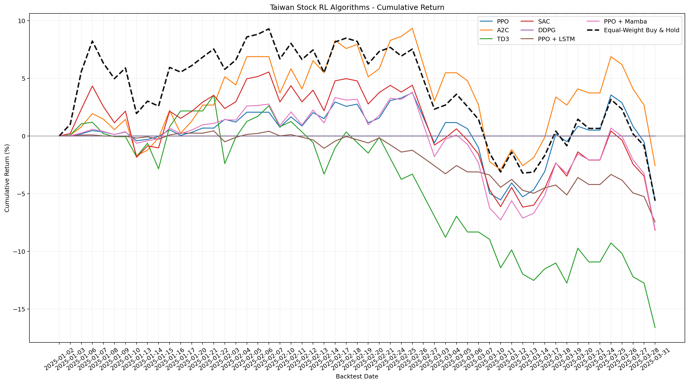

# Taiwan FinRL Lab

這個專案把原本的美股 FinRL 範例改為台股大型代表股，並提供可操作的網頁儀表板。

支援模型：PPO、A2C、TD3、SAC、DDPG、PPO + LSTM、PPO + Mamba。

## 專案架構


## 建立環境

```powershell
conda env create -f environment.yml
conda activate finrl-tw
```

## 啟動網頁

```powershell
uvicorn app:app --reload
```

開啟 `http://127.0.0.1:8000`，選擇股票、演算法與日期後即可建立背景訓練工作。

## 僅產生台股資料

```powershell
python FinRL_StockTrading_2026_1_data.py --all-30
```

Yahoo Finance 的台灣上市股票代碼使用 `.TW` 後綴。預設股票池定義在 `taiwan_stocks.py`。

## 比較所有演算法

```powershell
python compare_all_algorithms.py
```

程式會依序訓練七種演算法，加入等權買入持有基準，並將比較圖與 CSV 儲存至
`results/all_algorithms`。每個模型的回測結果會快取，重新執行時只訓練缺少的模型。

## 實驗結果
報酬率圖(目前只以台積電和聯發科去做選擇)
