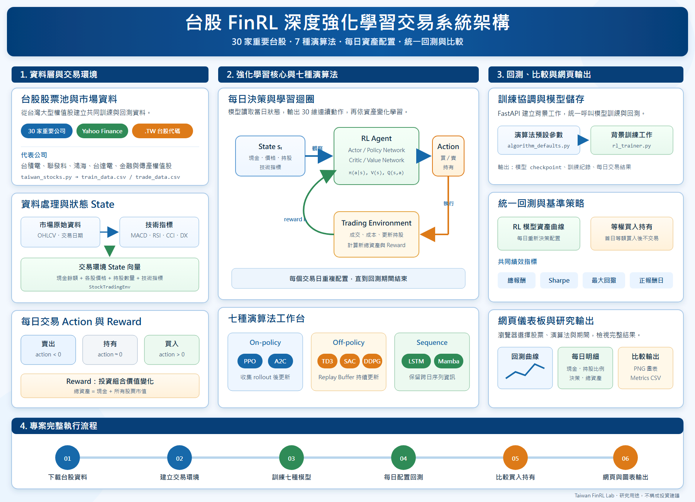
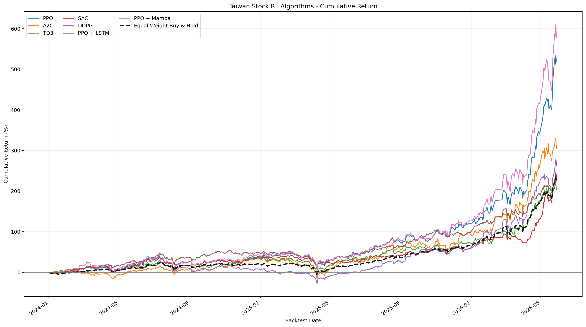

# Taiwan FinRL Lab

這個專案將原本的美股 FinRL 範例改成台股大型代表股，並提供本機網頁儀表板，用來比較多種深度強化學習交易模型在台股投資組合上的表現。

支援演算法：

```text
PPO、A2C、TD3、SAC、DDPG、PPO + LSTM、PPO + Mamba
```

> 本專案僅供研究與教學用途，不構成任何投資建議。

## 專案架構



```text
台股資料下載與整理
        ↓
30 檔台股 train_data.csv / trade_data.csv
        ↓
FinRL StockTradingEnv 交易環境
        ↓
七種強化學習演算法訓練
        ↓
2024-2026 回測模擬交易
        ↓
每日現金、持股、決策、總資產
        ↓
網頁儀表板與比較圖輸出
```

主要檔案：

```text
app.py                                  FastAPI 網頁後端
web/                                    前端儀表板
data_pipeline.py                        台股資料下載與技術指標處理
taiwan_stocks.py                        30 檔台股股票池
rl_trainer.py                           訓練、回測、每日交易明細
algorithm_defaults.py                   各演算法預設參數
compare_all_algorithms.py               七種模型與買入持有比較繪圖
recurrent_ppo_finrl.py                  PPO + LSTM
ppo_mamba_finrl.py                      PPO + Mamba
docs/taiwan_finrl_architecture.png      專案架構圖
```

## 資料集

資料來源為 Yahoo Finance，台股上市股票代碼使用 `.TW` 後綴。

目前正式資料包含 30 檔台股：

```text
1216.TW, 1301.TW, 1303.TW, 2002.TW, 2303.TW,
2308.TW, 2317.TW, 2327.TW, 2330.TW, 2345.TW,
2357.TW, 2360.TW, 2379.TW, 2382.TW, 2383.TW,
2412.TW, 2454.TW, 2881.TW, 2882.TW, 2884.TW,
2885.TW, 2886.TW, 2887.TW, 2891.TW, 3008.TW,
3037.TW, 3045.TW, 3711.TW, 5871.TW, 6505.TW
```

資料切分：

| 資料檔 | 用途 | 日期區間 | 交易日數 | 股票數 |
|---|---|---:|---:|---:|
| `train_data.csv` | 訓練 | 2018-01-02 至 2023-12-29 | 1459 | 30 |
| `trade_data.csv` | 回測 / Test | 2024-01-02 至 2026-05-29 | 579 | 30 |

原始資料欄位包含：

```text
date, tic, open, high, low, close, volume, day,
macd, boll_ub, boll_lb, rsi_30, cci_30, dx_30,
close_30_sma, close_60_sma, turbulence, vix
```

其中 `open/high/low/close/volume` 來自價格資料，技術指標由 FinRL 的 feature engineering 流程產生。

## 模型輸入特徵

模型每天看到的是 FinRL `StockTradingEnv` 的 state。以 30 檔股票為例：

```text
state = 現金
      + 30 檔股票目前 close 價格
      + 30 檔股票目前持股數量
      + 30 檔股票 × 8 個技術指標
```

使用的 8 個技術指標：

```text
macd
boll_ub
boll_lb
rsi_30
cci_30
dx_30
close_30_sma
close_60_sma
```

因此 state 維度為：

```text
1 + 2 × 30 + 8 × 30 = 301
```

說明：

```text
1             現金
30            各股票 close 價格
30            各股票持股數量
8 × 30 = 240  每檔股票的技術指標
```

`vix` 與 `turbulence` 會保留在資料中；目前回測環境使用 `vix` 作為風險指標欄位，並設定 `turbulence_threshold=70`。

## 模型輸出與交易設定

每個交易日，模型會輸出一個 30 維 action：

```text
action[0]  對第 1 檔股票的買賣決策
action[1]  對第 2 檔股票的買賣決策
...
action[29] 對第 30 檔股票的買賣決策
```

動作意義：

```text
action > 0   買入
action < 0   賣出
action ≈ 0   持有
```

交易環境設定：

| 參數 | 數值 | 意義 |
|---|---:|---|
| `initial_amount` | 1,000,000 | 初始資金 |
| `hmax` | 100 | 每檔股票每次最大交易股數 |
| `transaction_cost` | 0.001 | 買賣交易成本，各 0.1% |
| `reward_scaling` | 1e-4 | reward 縮放 |

Reward 來自投資組合總價值變化：

```text
總資產 = 現金 + 所有股票市值
```

## 演算法預設參數

PPO、TD3、SAC 參考 `FinRL_StockTrading_2026_2_train.py`；A2C、DDPG 使用 FinRL / Stable-Baselines3 預設；PPO + LSTM 與 PPO + Mamba 使用較保守的序列模型設定。

| 演算法 | learning_rate | n_steps | batch_size | 其他主要設定 |
|---|---:|---:|---:|---|
| PPO | 0.00025 | 2048 | 128 | `ent_coef=0.01` |
| A2C | 0.0007 | 5 | - | `ent_coef=0.01` |
| TD3 | 0.001 | - | 100 | `buffer_size=1,000,000` |
| SAC | 0.0001 | - | 128 | `buffer_size=100,000`, `learning_starts=100`, `ent_coef=auto_0.1` |
| DDPG | 0.001 | - | 128 | `buffer_size=50,000` |
| PPO + LSTM | 0.00025 | 512 | 128 | `lstm_hidden_size=256` |
| PPO + Mamba | 0.00025 | 512 | 128 | `sequence_length=16`, `d_model=128`, `d_state=16` |

## 建立環境

```powershell
conda env create -f environment.yml
conda activate finrl-tw
```

也可以使用 `requirements.txt` 安裝套件：

```powershell
pip install -r requirements.txt
```

## 啟動網頁

```powershell
conda activate finrl-tw
uvicorn app:app --host 127.0.0.1 --port 8765
```

開啟：

```text
http://127.0.0.1:8765/
```

網頁可以選擇股票、演算法、訓練期間、回測期間與訓練參數。完成回測後，可查看：

```text
總報酬
Sharpe Ratio
最大回撤
正報酬日
每日現金
每日持股比例
每日買賣決策
每日總資產
```

## 產生台股資料

```powershell
python FinRL_StockTrading_2026_1_data.py --all-30
```

預設股票池定義在：

```text
taiwan_stocks.py
```

## 比較所有演算法

正式 30 檔台股、七種演算法各 20,000 timesteps：

```powershell
python compare_all_algorithms.py --output-dir results\all_algorithms --total-timesteps 20000 --device cpu
```

快速測試版，仍使用 30 檔股票，但訓練較短：

```powershell
python compare_all_algorithms.py --output-dir results\all_algorithms_30_quick --total-timesteps 1000 --n-steps 256 --batch-size 128 --device cpu --force
```

程式會產生：

```text
all_algorithms_cumulative_return.png   累積報酬率圖
all_algorithms_portfolio_value.png     投資組合價值圖
all_algorithms_portfolio_value.csv     每日資產曲線
all_algorithms_metrics.csv             績效指標
```

每個演算法的回測結果會快取在自己的資料夾中。若重新執行且檔案已存在，程式會讀取 cache；若要重訓，加入 `--force`。

## 正式 20,000 Timesteps 結果

正式結果儲存在：

```text
results/all_algorithms/
```



本次正式回測摘要：

| 策略 | 最終資產 | 總報酬 |
|---|---:|---:|
| PPO + Mamba | 6,769,492 | 576.95% |
| PPO | 6,181,716 | 518.17% |
| A2C | 4,080,056 | 308.01% |
| DDPG | 3,749,976 | 275.00% |
| SAC | 3,383,753 | 238.38% |
| PPO + LSTM | 3,325,730 | 232.57% |
| 等權買入持有 | 3,299,155 | 230.24% |
| TD3 | 3,037,214 | 203.72% |

等權買入持有策略代表：在回測第一天將資金平均分配到 30 檔股票，買入後不再交易。

## 注意事項

- 強化學習結果會受到隨機種子、資料期間、交易成本、訓練步數與硬體影響。
- 20,000 timesteps 在 CPU 上可能需要一段時間，尤其 TD3、SAC、DDPG、PPO + Mamba 通常較慢。
- 回測績效不代表未來報酬。
